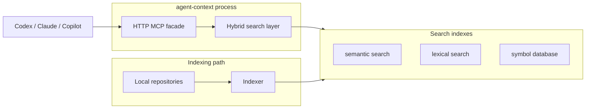
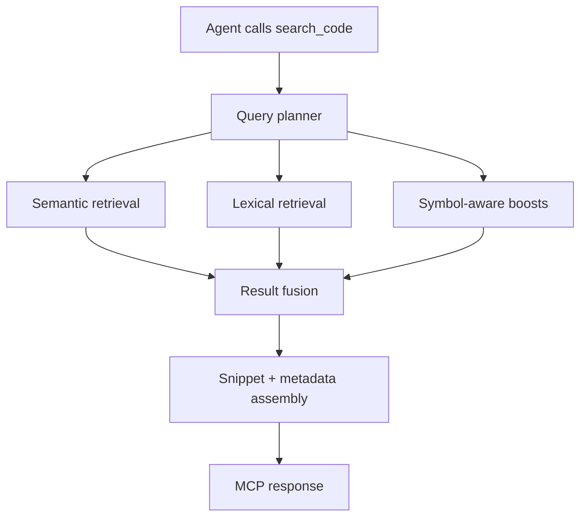

# agent-context

`agent-context` is a Rust-native MCP server that gives coding agents indexed code search across one or more local repositories.

> [!IMPORTANT]
> This project is heavily inspired by [claude-context](https://github.com/zilliztech/claude-context).
> The core idea comes directly from that project: give coding agents an indexed code-search surface instead of making them repeatedly rediscover a codebase through shell search.
> `agent-context` takes that approach and focuses it on a Rust-native local server, a shared HTTP MCP facade, multi-codebase search, and lower steady-state resource usage.

## Overview

`agent-context` makes your agents smarter and faster. It helps them find the right code paths earlier, make more accurate changes in large codebases, move through tasks with fewer dead ends, and reduce token usage along the way.

## How This Differs From MemPalace

[MemPalace](https://github.com/MemPalace/mempalace) is a persistent memory system for agents. It is designed around long-term recall: conversations, mined knowledge, knowledge graphs, and agent diaries.

`agent-context` is narrower. It is a code-search system for coding agents:

- MemPalace helps an agent remember.
- `agent-context` helps an agent navigate and retrieve the right code.

They are complementary more than competitive. If you want long-term agent memory, MemPalace is solving that problem. If you want more accurate semantic, lexical, and symbol search over real codebases, that is what `agent-context` is built for.

## Features

`agent-context` is easiest to understand as a set of agent-facing capabilities:

- **Semantic search** for natural-language queries like `find the GraphQL schema builder`.
- **Symbol search** for exact definitions like `build_schema`, `KeyStore`, or `SessionManager`.
- **File outlines** so an agent can inspect structure without scanning entire files.
- **Hybrid ranking** so exact identifiers, paths, and semantic matches work in one search flow.
- **Multi-repo scopes** so one MCP server can search a named workspace instead of a single repo.
- **Shared local MCP endpoint** so Codex, Claude, Copilot, and other MCP clients can use the same index.
- **Higher search accuracy in large codebases** where agents often miss the existing implementation path, fail to find the right symbol or file, and start inventing parallel solutions that should not exist.
- **Fewer tokens used per task** because agents can retrieve the right files, symbols, and snippets earlier instead of spending turns probing, re-searching, and reading the wrong parts of the tree.
- **Lower steady-state resource usage** than heavier multi-process setups, while still keeping semantic, lexical, and symbol search available.
- **Explicit local control** over indexing, refreshes, providers, and service lifecycle.

The storage and indexing details matter, but they are implementation details. The product surface is simple: agents get a better way to search code.

That accuracy point matters. In larger repositories, the failure mode is usually not that an agent finds nothing. It is that the agent finds one plausible path, misses the real one, and then starts editing or building around an incomplete mental model of the codebase. Better semantic, lexical, and symbol search reduces that drift and makes it much more likely that the agent works on the code that already exists instead of creating a second, parallel path.

## How It Works

### High-level architecture



### Search request flow



## Quick Start

This project assumes an agent can help with setup. The install path below is designed to be followed directly by an agent or a human.

### Prerequisites

- macOS
- Docker Desktop or another local Docker runtime
- Homebrew
- one embedding provider:
  - Voyage
  - OpenAI
  - Ollama

### 1. Install the tap and binary

```bash
brew install jeremymefford/agent-context-mcp/agent-context
agent-context --help
```

### 2. Start Milvus

```bash
docker compose -f docker/milvus-compose.yml up -d
```

### 3. Create a starter config

```bash
agent-context init --provider voyage --repo /absolute/path/to/repo
```

The canonical config path for the Homebrew install is:

```text
~/Library/Application Support/agent-context/config.toml
```

Verify it exists:

```bash
ls -l ~/Library/Application\ Support/agent-context/config.toml
```

### 4. Set up an embedding provider

`agent-context` needs an embedding provider for semantic indexing and semantic search. Choose one of these:

> [!WARNING]
> If you choose a hosted provider, `agent-context` will send codebase content to that provider to generate embeddings. That means **Voyage** and **OpenAI** will receive text derived from the repositories you index. If that is not acceptable for your environment, use **Ollama** instead.

<details>
<summary>Voyage</summary>

- Best fit if you want a hosted provider that is strong on code and retrieval tasks.
- Start here:
  - docs: [Voyage API key and installation](https://docs.voyageai.com/docs/api-key-and-installation)
  - dashboard: [Voyage dashboard](https://dash.voyageai.com/)
- What to do:
  - create a Voyage account
  - open the API keys section in the dashboard
  - create a secret key
  - store the key where the Homebrew service can read it
- Good default:
  - keep the README example config and use Voyage if you want the simplest hosted setup for code search

Recommended Homebrew service setup:

```toml
[embedding.voyage]
api_key_env = "VOYAGE_API_KEY"
key_file = "~/Library/Application Support/agent-context/voyage_key"
```

```bash
mkdir -p ~/Library/Application\ Support/agent-context
printf '%s\n' 'YOUR_VOYAGE_KEY' > ~/Library/Application\ Support/agent-context/voyage_key
chmod 600 ~/Library/Application\ Support/agent-context/voyage_key
```

</details>

<details>
<summary>OpenAI</summary>

- Best fit if you already use the OpenAI API and want hosted embeddings without adding another provider account.
- Start here:
  - embeddings guide: [OpenAI embeddings guide](https://platform.openai.com/docs/guides/embeddings)
  - API keys: [OpenAI API keys](https://platform.openai.com/settings/organization/api-keys)
- What to do:
  - create or use an OpenAI API account
  - create an API key
  - make that key visible to the Homebrew service
- Good default:
  - use one of the current `text-embedding-3` models and keep it stable once you start indexing

Recommended Homebrew service setup:

```toml
[embedding.openai]
api_key_env = "OPENAI_API_KEY"
key_file = "~/Library/Application Support/agent-context/openai_key"
base_url = "https://api.openai.com/v1"
```

```bash
mkdir -p ~/Library/Application\ Support/agent-context
printf '%s\n' 'YOUR_OPENAI_KEY' > ~/Library/Application\ Support/agent-context/openai_key
chmod 600 ~/Library/Application\ Support/agent-context/openai_key
```

</details>

<details>
<summary>Ollama</summary>

- Best fit if you want a fully local provider instead of a hosted API.
- Start here:
  - embeddings docs: [Ollama embeddings](https://docs.ollama.com/capabilities/embeddings)
  - install Ollama: [ollama.com/download](https://ollama.com/download)
  - model library: [Ollama library](https://ollama.com/library)
- What to do:
  - install Ollama
  - start the Ollama server
  - pull an embedding model locally before continuing
- Recommended models:
  - `embeddinggemma`
    - good default if you want the simplest current Ollama recommendation
    - model page: [embeddinggemma](https://ollama.com/library/embeddinggemma)
  - `qwen3-embedding`
    - good option if you want a newer general-purpose embedding model from the current Ollama recommendations
    - model page: [qwen3-embedding](https://ollama.com/library/qwen3-embedding)
  - `all-minilm`
    - good option if you want a smaller, lighter local model
    - model page: [all-minilm](https://ollama.com/library/all-minilm)
- Example:

```bash
ollama pull embeddinggemma
curl http://localhost:11434/api/embed -d '{"model":"embeddinggemma","input":"hello world"}'
```

</details>

If you have never used an embedding provider before:

- choose **Voyage** if you want the easiest hosted path
- choose **OpenAI** if you already use OpenAI API keys elsewhere
- choose **Ollama** if you want everything local and are comfortable running one more local service

Your `agent-context init --provider ...` choice should match the provider you actually plan to use.

### 5. Validate the setup

```bash
agent-context doctor
```

Do not continue until `doctor` reports no blocking issues.

### 6. Start the local service

`brew services` is the preferred service layer.

```bash
brew services start agent-context
brew services list | grep agent-context
curl http://127.0.0.1:8765/health
```

### 7. Print MCP config for your client

```bash
agent-context print-mcp-config --client codex
```

Supported values:

- `codex`
- `claude`
- `copilot`

### 8. Index your repos

```bash
agent-context refresh-all
# or for a clean rebuild
agent-context reindex-all
```

### 9. Install post-commit hooks

```bash
agent-context install-hook /absolute/path/to/repo
```

## What Agents Get

The MCP server is the main product surface.

Current tools:

- `list_scopes`
- `index_codebase`
- `search_code`
- `search_symbols`
- `get_file_outline`
- `explain_search`
- `clear_index`
- `get_indexing_status`

Preferred routing:

- use `list_scopes` first in an unfamiliar workspace
- use `search_symbols` first for exact definition lookup
- use `get_file_outline` once the target file is known
- use `search_code` for broader semantic or hybrid discovery

## Example Agent Workflow

Typical flow for a code-assistant task:

1. `list_scopes`
2. `search_symbols` for an exact symbol if one is known
3. `search_code` for broader behavior or semantic discovery
4. `get_file_outline` on the chosen file
5. read and edit the exact files that the search results identified

## CLI Commands

Setup and repair:

- `agent-context init`
- `agent-context doctor`
- `agent-context install-hook <repo>`
- `agent-context print-mcp-config --client codex|claude|copilot`
- `agent-context prune-stale-vector-collections` (dry-run)
- `agent-context prune-stale-vector-collections --apply`
- `agent-context release-vector-collections`

Indexing and serving:

- `agent-context refresh-one <scope-or-absolute-repo>`
- `agent-context refresh-all`
- `agent-context reindex-all`
- `agent-context search <scope-or-absolute-repo> "<query>"`
- `agent-context list-tools`
- `agent-context serve --listen 127.0.0.1:8765 --config ~/Library/Application\ Support/agent-context/config.toml`

## Configuration

The canonical config shape is:

```toml
snapshot_path = "~/Library/Application Support/agent-context/state/snapshot.json"
index_root = "~/Library/Application Support/agent-context/index-v1"
default_group = "workspace"

[embedding]
provider = "voyage" # or openai / ollama
model = "voyage-code-3"

[embedding.voyage]
api_key_env = "VOYAGE_API_KEY"

[milvus]
address = "127.0.0.1:19530"

[freshness]
# audit_interval_secs = 900

[search]
max_concurrent_requests = 2
max_concurrent_repo_searches = 4
max_concurrent_lexical_tasks = 2
max_concurrent_dense_tasks = 2
max_warm_repos = 4

[[groups]]
id = "workspace"
label = "Workspace"
repos = [
  "/absolute/path/to/repo",
]
```

See the full template in [config.example.toml](config.example.toml).

## Under The Hood

This is the technical part that sits below the feature surface:

- **Rust MCP server** with a shared local HTTP bridge
- **Milvus** for dense semantic retrieval
- **Tantivy** for lexical, path-aware, and exact-token retrieval
- **SQLite** for symbol metadata and file outlines
- **Hybrid search planner** that routes and fuses dense, lexical, and symbol signals
- **Bounded warm-reader cache** and global search budgets to keep latency and memory under control

## Agent Notes

If an agent is performing installation or recovery:

- prefer absolute repo paths
- run `doctor` before and after service installation
- if `doctor` reports stale vector collections, run `prune-stale-vector-collections` first, then rerun with `--apply` after reviewing the names
- if `doctor` reports too many loaded vector collections, run `release-vector-collections`; it unloads Milvus memory without deleting indexes
- use `print-mcp-config` instead of hand-writing client snippets
- assume provider or model changes require `reindex-all`
- prefer `install-hook` over manual hook editing
