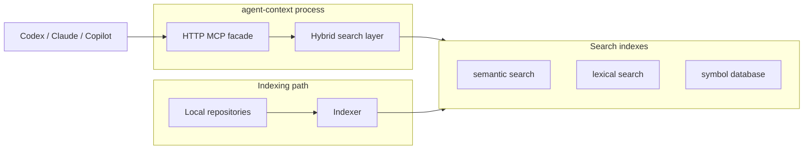
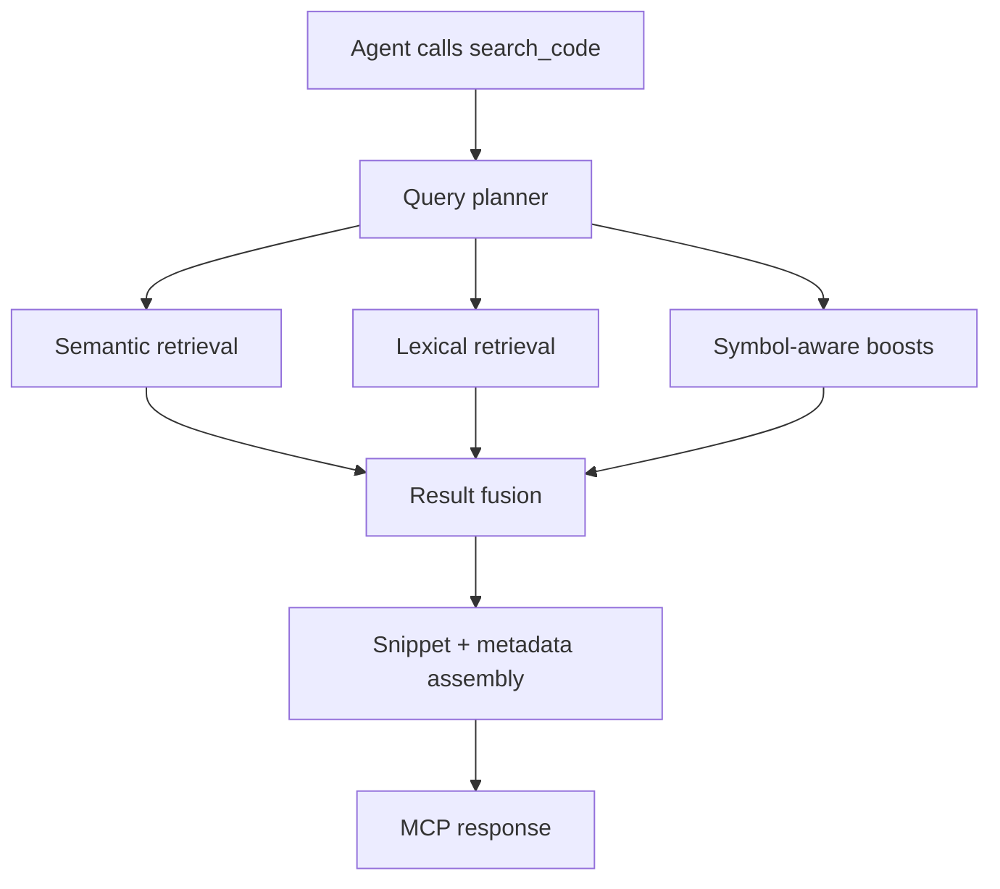

# agent-context

`agent-context` is a Rust-native MCP server that gives coding agents indexed code search across one or more local repositories.

> [!IMPORTANT]
> This project is heavily inspired by [claude-context](https://github.com/zilliztech/claude-context).
> The core idea comes directly from that project: give coding agents an indexed code-search surface instead of making them repeatedly rediscover a codebase through shell search.
> `agent-context` takes that approach and focuses it on a Rust-native local server, a shared HTTP MCP facade, multi-codebase search, and lower steady-state resource usage.

## Overview

`agent-context` makes your agents smarter and faster. It helps them find the right code paths earlier, make more accurate changes in large codebases, move through tasks with fewer dead ends, and reduce token usage along the way.

## How This Differs From MemPalace

[MemPalace](https://github.com/MemPalace/mempalace) is a persistent memory system for agents. It is designed around long-term recall: conversations, mined knowledge, knowledge graphs, and agent diaries.

`agent-context` is narrower. It is a code-search system for coding agents:

- MemPalace helps an agent remember.
- `agent-context` helps an agent navigate and retrieve the right code.

They are complementary more than competitive. If you want long-term agent memory, MemPalace is solving that problem. If you want more accurate semantic, lexical, and symbol search over real codebases, that is what `agent-context` is built for.

## Features

`agent-context` is easiest to understand as a set of agent-facing capabilities:

- **Semantic search** for natural-language queries like `find the GraphQL schema builder`.
- **Symbol search** for exact definitions like `build_schema`, `KeyStore`, or `SessionManager`.
- **Exact text search** for literal strings inside a known repo, file, or bounded subtree when an agent needs precise confirmation instead of another ranked search.
- **Edit-target preparation** that returns live-file exact content, bounded edit windows, and unique patch anchors immediately before editing.
- **File outlines** so an agent can inspect structure without scanning entire files.
- **Hybrid ranking** so exact identifiers, paths, and semantic matches work in one search flow.
- **Multi-repo scopes** so one MCP server can search a named workspace instead of a single repo.
- **Shared local MCP endpoint** so Codex, Claude, Copilot, and other MCP clients can use the same index.
- **Higher search accuracy in large codebases** where agents often miss the existing implementation path, fail to find the right symbol or file, and start inventing parallel solutions that should not exist.
- **Fewer tokens used per task** because agents can retrieve the right files, symbols, and snippets earlier instead of spending turns probing, re-searching, and reading the wrong parts of the tree.
- **Lower steady-state resource usage** than heavier multi-process setups, while still keeping semantic, lexical, and symbol search available.
- **Explicit local control** over indexing, refreshes, providers, and service lifecycle.

The storage and indexing details matter, but they are implementation details. The product surface is simple: agents get a better way to search code.

That accuracy point matters. In larger repositories, the failure mode is usually not that an agent finds nothing. It is that the agent finds one plausible path, misses the real one, and then starts editing or building around an incomplete mental model of the codebase. Better semantic, lexical, and symbol search reduces that drift and makes it much more likely that the agent works on the code that already exists instead of creating a second, parallel path.

## Language Support

`agent-context` does not support every language equally. Today, the practical support tiers are:

- **Strong support**: Rust, TypeScript, TSX, JavaScript, JSX, Python, Go, Java
- **Supported with more conservative symbol extraction**: C, C++, C#, Kotlin, PHP, Ruby, Swift, Scala
- **Web text/config support**: HTML, CSS, SCSS, Sass, Less, Vue, Svelte, Astro, SVG, MDX, JSON, JSONC, JSON5, YAML, TOML, web manifests, GraphQL, Prisma, robots-style text files, and common template files
- **Content plus heading outlines**: Markdown and MDX

What that means in practice:

- All listed languages are indexed for code search and lexical retrieval.
- Strong-support languages are the ones with the highest confidence for symbol search and outlines.
- The conservative tier is still searchable, but symbol extraction is more best-effort and intentionally guarded to avoid poisoning refreshes on ambiguous syntax or generated code.
- Web text/config files are indexed for semantic and lexical retrieval with generic text chunking unless a dedicated parser is available.
- Markdown and MDX headings are available through file outlines and symbol search as `heading` entries.
- Selected hidden repo config directories are traversed for supported file types, including CI files such as `.github/workflows/*.yml`, while hidden caches, VCS internals, and root dotfiles remain excluded by default.

## How It Works

### High-level architecture


```mermaid
flowchart LR
    A["Codex / Claude / Copilot"] --> B

    subgraph Server["agent-context process"]
        direction TB
        B["HTTP MCP facade"]
        C["Hybrid search layer"]
        B --> C
    end

    subgraph Indexes["Search indexes"]
        direction TB
        D["semantic search"]
        E["lexical search"]
        F["symbol database"]
    end

    subgraph Ingest["Indexing path"]
        direction LR
        H["Local repositories"] --> G["Indexer"]
    end

    C --> Indexes
    G --> Indexes
```

### Search request flow


```mermaid
flowchart TD
    A["Agent calls search_code"] --> B["Query planner"]
    B --> C["Semantic retrieval"]
    B --> D["Lexical retrieval"]
    B --> E["Symbol-aware boosts"]
    C --> F["Result fusion"]
    D --> F
    E --> F
    F --> G["Snippet + metadata assembly"]
    G --> H["MCP response"]
```

## Quick Start

This project assumes an agent can help with setup. The install path below is designed to be followed directly by an agent or a human.

### Prerequisites

- macOS
- Docker Desktop or another local Docker runtime
- Homebrew
- one embedding provider:
  - Voyage
  - OpenAI
  - Ollama

### 1. Install the tap and binary

```bash
brew install jeremymefford/agent-context-mcp/agent-context
agent-context --help
```

Release binaries and local `aarch64-apple-darwin` source builds target M1+
Apple Silicon hardware with `target-cpu=apple-m1`, so crates like
`xxhash-rust` can take their accelerated ARM code paths automatically.

### 2. Start Milvus

```bash
docker compose -f docker/milvus-compose.yml up -d
```

### 3. Create a starter config

```bash
agent-context init --provider voyage --repo /absolute/path/to/repo
```

The canonical config path for the Homebrew install is:

```text
~/Library/Application Support/agent-context/config.toml
```

Verify it exists:

```bash
ls -l ~/Library/Application\ Support/agent-context/config.toml
```

### 4. Set up an embedding provider

`agent-context` needs an embedding provider for semantic indexing and semantic search. Choose one of these:

You can keep one global default profile, or define multiple named profiles and assign specific repos to a local or hosted provider.

> [!WARNING]
> If you choose a hosted provider, `agent-context` will send codebase content to that provider to generate embeddings. That means **Voyage** and **OpenAI** will receive text derived from the repositories you index. If that is not acceptable for your environment, use **Ollama** instead.

<details>
<summary>Voyage</summary>

- Best fit if you want a hosted provider that is strong on code and retrieval tasks.
- Start here:
  - docs: [Voyage API key and installation](https://docs.voyageai.com/docs/api-key-and-installation)
  - dashboard: [Voyage dashboard](https://dash.voyageai.com/)
- What to do:
  - create a Voyage account
  - open the API keys section in the dashboard
  - create a secret key
  - store the key where the Homebrew service can read it
- Good default:
  - keep the README example config and use Voyage if you want the simplest hosted setup for code search

Recommended Homebrew service setup:

```toml
[embedding]
default_profile = "hosted"

[embedding.profiles.hosted]
provider = "voyage"
model = "voyage-code-3"

[embedding.profiles.hosted.voyage]
api_key_env = "VOYAGE_API_KEY"
key_file = "~/Library/Application Support/agent-context/voyage_key"
```

```bash
mkdir -p ~/Library/Application\ Support/agent-context
printf '%s\n' 'YOUR_VOYAGE_KEY' > ~/Library/Application\ Support/agent-context/voyage_key
chmod 600 ~/Library/Application\ Support/agent-context/voyage_key
```

</details>

<details>
<summary>OpenAI</summary>

- Best fit if you already use the OpenAI API and want hosted embeddings without adding another provider account.
- Also works for OpenAI-compatible local servers such as LM Studio.
- Start here:
  - embeddings guide: [OpenAI embeddings guide](https://platform.openai.com/docs/guides/embeddings)
  - API keys: [OpenAI API keys](https://platform.openai.com/settings/organization/api-keys)
- What to do:
  - create or use an OpenAI API account
  - create an API key
  - make that key visible to the Homebrew service
- Good default:
  - use one of the current `text-embedding-3` models and keep it stable once you start indexing

LM Studio notes:

- Use the `openai` provider with the LM Studio OpenAI-compatible server.
- Set `base_url` to your LM Studio server URL, usually `http://127.0.0.1:1234/v1`.
- Set `model` to the embedding model id exposed by LM Studio, not to a chat model id.
- `agent-context` currently always sends a bearer token in `openai` mode, so configure `api_key_env` or `key_file` with a non-empty value and make sure your LM Studio server tolerates that header.

Recommended Homebrew service setup:

```toml
[embedding]
default_profile = "hosted"

[embedding.profiles.hosted]
provider = "openai"
model = "text-embedding-3-small"

[embedding.profiles.hosted.openai]
api_key_env = "OPENAI_API_KEY"
key_file = "~/Library/Application Support/agent-context/openai_key"
base_url = "https://api.openai.com/v1"
```

```bash
mkdir -p ~/Library/Application\ Support/agent-context
printf '%s\n' 'YOUR_OPENAI_KEY' > ~/Library/Application\ Support/agent-context/openai_key
chmod 600 ~/Library/Application\ Support/agent-context/openai_key
```

Example LM Studio setup:

```toml
[embedding]
default_profile = "local"

[embedding.profiles.local]
provider = "openai"
model = "text-embedding-nomic-embed-text-v1.5"

[embedding.profiles.local.openai]
api_key_env = "LM_STUDIO_API_KEY"
base_url = "http://127.0.0.1:1234/v1"
```

</details>

<details>
<summary>Ollama</summary>

- Best fit if you want a fully local provider instead of a hosted API.
- Start here:
  - embeddings docs: [Ollama embeddings](https://docs.ollama.com/capabilities/embeddings)
  - install Ollama: [ollama.com/download](https://ollama.com/download)
  - model library: [Ollama library](https://ollama.com/library)
- What to do:
  - install Ollama
  - start the Ollama server
  - pull an embedding model locally before continuing
- Recommended models:
  - `embeddinggemma`
    - good default if you want the simplest current Ollama recommendation
    - model page: [embeddinggemma](https://ollama.com/library/embeddinggemma)
  - `qwen3-embedding`
    - good option if you want a newer general-purpose embedding model from the current Ollama recommendations
    - model page: [qwen3-embedding](https://ollama.com/library/qwen3-embedding)
  - `all-minilm`
    - good option if you want a smaller, lighter local model
    - model page: [all-minilm](https://ollama.com/library/all-minilm)
- Example:

```bash
ollama pull embeddinggemma
curl http://localhost:11434/api/embed -d '{"model":"embeddinggemma","input":"hello world"}'
```

Some Ollama embedding models support a `dimensions` request parameter. Set
`embedding.profiles.<name>.ollama.dimensions` to request a specific model output
width. Set `truncate_dimensions` as well when you want `agent-context` to retain
only the leading dimensions locally; for example, request Qwen's 4096-dimensional
output and locally store/search its first 1024 dimensions.

</details>

If you have never used an embedding provider before:

- choose **Voyage** if you want the easiest hosted path
- choose **OpenAI** if you already use OpenAI API keys elsewhere
- choose **Ollama** if you want everything local and are comfortable running one more local service

Your `agent-context init --provider ...` choice should match the provider you actually plan to use.

### 5. Validate the setup

```bash
agent-context doctor
```

Do not continue until `doctor` reports no blocking issues.

### 6. Start the local service

`brew services` is the preferred service layer.

```bash
brew services start agent-context
brew services list | grep agent-context
curl http://127.0.0.1:8765/health
```

### 7. Print MCP config for your client

```bash
agent-context print-mcp-config --client codex
```

Supported values:

- `codex`
- `claude`
- `copilot`

### 8. Give your agent the right instructions

After the MCP is connected, add something like this to your global agent instructions or repo-local `AGENTS.md` / `CLAUDE.md`:

```text
Use the agent-context MCP as the first step for repository discovery and code search.

- Call list_scopes first in an unfamiliar workspace.
- Use search_symbols for exact definition lookup when the symbol name is known or suspected.
- Use search_code for broader semantic or hybrid discovery.
- Treat search_code snippets as discovery hints, not authoritative reads.
- Use search_text for exact strings, identifiers, test names, and log lines once the repo, file, or subtree is known.
- Use get_file_outline when the file is known and you need structure.
- Use prepare_edit_target only immediately before patching a known location.
- Do not use prepare_edit_target for broad reading, overview, or header scanning.
- Fall back to shell rg, sed, or bat only for regex-heavy cases, unindexed files, or MCP outages.
```

### 9. Index your repos

```bash
agent-context refresh-all
# or for a clean rebuild
agent-context reindex-all
```

Relationship analysis uses index format `v2`. Upgrading does not delete or rebuild an existing
index automatically: run `agent-context reindex-all` explicitly before using the graph tools. A
successful full reindex also compacts the canonical relationship store; failed reindexes skip the
final compaction step.

Incremental refreshes maintain storage automatically. Unchanged repositories do not rewrite the
relationship index; changed repositories prune obsolete logical keys, checkpoint SQLite without
blocking readers, and merge relationship-index tombstones once they reach 10%. SQLite reuses free
pages during normal churn and performs a full vacuum only after at least 64 MiB and 20% of the
database are reclaimable. This keeps routine refreshes cheap while allowing the index to contract
after large deletes or repository reorganizations.

### 10. Install post-commit hooks

```bash
agent-context install-hook /absolute/path/to/repo
```

## What Agents Get

The MCP server is the main product surface.

Current tools:

- `list_scopes`
- `index_codebase`
- `search_symbols`
- `search_code`
- `search_text`
- `get_file_outline`
- `prepare_edit_target`
- `analyze_impact`
- `trace_path`
- `analyze_changes`
- `check_index_coverage`
- `explain_search`
- `clear_index`
- `get_indexing_status`

Preferred routing:

- use `list_scopes` first in an unfamiliar workspace
- use `search_symbols` first for exact definition lookup; request `includeSymbolId` when you plan to hand that id directly to `prepare_edit_target`, `analyze_impact`, or `trace_path`
- use `analyze_impact` for bounded reverse traversal from one Rust or TypeScript definition; pass either `symbolId` or `file + line`, and consume the separate callers, transitive dependents, and affected-test sections
- use `trace_path` for the shortest highest-confidence directed dependency paths; each endpoint accepts either a symbol id or a `file + line` selector
- use `analyze_changes` for a validated Git `baseRef` (default `HEAD`) versus the current working tree; it includes staged, unstaged, renamed, deleted, and optionally untracked files, but does not compare two historical refs
- use `check_index_coverage` before treating an empty graph result as “no impact”; it reports readiness, stale files, unsupported files, confidence tiers, unresolved references, and unstable identities
- graph tools return `detail: "compact"` agent-facing responses by default; inspect `status` first and follow executable `nextActions` for `needs_index`, `not_found`, empty, or truncated results; request `detail: "full"` only for complete canonical metadata
- use `search_code` for broader semantic or hybrid discovery; treat returned snippets as discovery hints, not authoritative reads
- use `search_text` for exact strings, identifiers, test names, and log lines inside a known repo, known file, or bounded repo-relative tree instead of narrow `rg`
- use `get_file_outline` once the target file is known and you need structure rather than broad file reads
- use `prepare_edit_target` only when the exact patch location is already known; it can take `symbolId` or a normal symbol hit shape like `file + symbolName (+ symbolKind/symbolContainer/lineHint)`, and it is not an overview or header-scanning tool
- when `prepare_edit_target` is given a known `file + query`, it returns the containing symbol body when that is small enough to patch safely; use the returned content as the authoritative edit window instead of falling back to shell line reads
- fall back to shell `rg` / `sed` / `bat` only for regex-heavy cases, unindexed files, or MCP outages

## Example Agent Workflow

Typical flow for a code-assistant task:

1. `list_scopes`
2. `search_symbols` for an exact symbol if one is known
   Ask for `includeSymbolId` when the next step needs impact, path, or edit preparation.
3. `search_code` for broader behavior or semantic discovery
4. `analyze_impact` or `trace_path` with returned symbol ids—or known file/line selectors—when structural dependency evidence is needed
5. `check_index_coverage` if a missing path or dependent could be a coverage limitation
6. `search_text` when a known repo, file, or subtree needs exact literal confirmation
7. `get_file_outline` on the chosen file
8. `prepare_edit_target` only after the exact patch location is known
   It can resolve by `symbolId` or by a concrete symbol hit in one file.
9. use shell reads only if regex is required or MCP exact inspection is unavailable

### Structural impact coverage

The relationship graph is deliberately narrower than code search. Rust and TypeScript/TSX are the
only guaranteed languages. SQLite is the canonical graph state and provides compact, deduplicated
edges and coverage accounting. A third per-repository Tantivy index provides exact
forward/reverse frontier lookup plus fuzzy target/evidence discovery and deterministic ranking.
Worktree overlays compose with the canonical graph and suppress canonical edges
originating in changed or deleted paths.

Public relationship kinds are `calls`, `imports`, `reexports`, `type_uses`, `implements`, and
`inherits`. Resolution confidence is fixed: `1000` exact qualified, `950` imported alias, `900`
same-module unique, `750` unique compatible repository symbol, `450` ambiguous name/method
candidate, and `300` lexical fallback. Traversal defaults exclude values below `650`; possible
candidates remain separately labeled and never become definite dependencies because of fuzzy or
semantic similarity. Coverage classifies `900-1000` as definite, `650-899` as probable structural
evidence, `300-649` as possible, and references with no candidate as unresolved. Repeated
occurrences between the same source, target, and relation kind share
one traversal edge while retaining representative evidence. Ambiguous lookups retain at most eight
path-local candidates; names with more than 256 compatible definitions stay unresolved rather than
creating an unbounded speculative frontier. Unresolved occurrences remain searchable in the
relationship evidence index so renamed and deleted declaration analysis can surface broken callers.
SQLite retains every unresolved occurrence, while Tantivy stores one representative document per
source owner, qualified target, and relation kind to avoid duplicate candidate hits and storage;
text/fuzzy matches are always returned at lexical confidence and never promoted to structural edges.

Graph output is advisory evidence, not a safety guarantee. External packages and cross-repository
targets remain unresolved. Dynamic dispatch, runtime registration, reflection, generated code,
macro expansion, and type-system behavior beyond syntax-visible declarations can create real
dependencies the graph cannot prove. TypeScript function declarations and direct arrow/function
expression variable declarations are structural symbol owners. Normal graph tools fail closed on an
updating, incompatible, or live-file-stale transactional graph generation. Impact and path requests
content-hash selected symbols immediately, verify SQLite/Tantivy generation counts, and establish a
full filesystem audit on first use. That audit is reused for at most 30 seconds; file metadata,
repository-generation changes, indexing, and `prepare_edit_target` invalidate or refresh it.
`check_index_coverage` exposes the same readiness boundary explicitly, distinguishing an empty
result from insufficient analysis.

All four graph tools return a structured object rather than a bare array. The first field agents
should inspect is `status`; common values include `ok`, `found`, `not_found`, `no_dependents`,
`truncated`, `needs_index`, `invalid_base`, `symbol_not_found`, and `unsupported`. Compact nodes use
the same handoff shape throughout: `symbolId`, `name`, `kind`, `file`, and `line`, plus bounded edge
evidence where relevant. Recoverable results include `nextActions` with a tool name, reason, and
arguments so clients can continue without parsing prose. `detail: "full"` retains logical keys,
complete coverage, and all canonical response fields for diagnostics or custom clients. Impact,
path, coverage, and change analysis report `liveAudit: "verified"` and can be conclusive only after
the current audited generation and selected symbol hashes match the indexed graph generation.

## CLI Commands

Setup and repair:

- `agent-context init`
- `agent-context doctor`
- `agent-context install-hook <repo>`
- `agent-context print-mcp-config --client codex|claude|copilot`
- `agent-context prune-stale-vector-collections` (dry-run)
- `agent-context prune-stale-vector-collections --apply`
- `agent-context reset-local-state` (dry-run)
- `agent-context reset-local-state --apply`
- `agent-context release-vector-collections`

Indexing and serving:

- `agent-context refresh-one <scope-or-absolute-repo>`
- `agent-context refresh-all`
- `agent-context reindex-all`
- `agent-context search <scope-or-absolute-repo> "<query>"`
- `agent-context list-tools`
- `agent-context serve --listen 127.0.0.1:8765 --config ~/Library/Application\ Support/agent-context/config.toml`

`refresh-one` is enqueue-only. It returns quickly after handing the request to the local `agent-context serve` process, and repeated requests for a repo already pending or running are merged instead of triggering back-to-back scans. The service persists accepted queued and running requests beside `snapshot.json`, so a normal service restart resumes them from the queue instead of discarding the remaining work. Invalid or no-longer-configured persisted repos are dropped; untracked legacy `indexing` entries are marked failed so status remains actionable. Use `--listen` if your local service is not on `127.0.0.1:8765`.

## Configuration

The canonical config shape is:

```toml
snapshot_path = "~/Library/Application Support/agent-context/state/snapshot.json"
index_root = "~/Library/Application Support/agent-context/index-v1"
default_group = "workspace"

[embedding]
default_profile = "hosted"

[embedding.profiles.hosted]
provider = "voyage"
model = "voyage-code-3"

[embedding.profiles.hosted.voyage]
api_key_env = "VOYAGE_API_KEY"

[embedding.profiles.local]
provider = "openai"
model = "text-embedding-nomic-embed-text-v1.5"

[embedding.profiles.local.openai]
api_key_env = "LM_STUDIO_API_KEY"
base_url = "http://127.0.0.1:1234/v1"

[[embedding.assignments]]
repo = "/absolute/path/to/local-repo"
profile = "local"

[indexing]
# conservative preserves the existing scan surface.
# aggressive also excludes generated output, dependency/vendor directories, package lockfiles,
# fixtures/testdata/snapshots, and files with ".generated." in their name.
exclusion_profile = "conservative"
# exclude_patterns = ["third_party/**"]
default_features = ["lexical", "semantic", "graph"]

# [[indexing.repo_rules]]
# repo = "/absolute/path/to/repo"
# features = ["lexical", "semantic"]
# exclude_patterns = ["fixtures/large/**"]
# include_patterns = ["vendor/required.rs"]

[worktrees]
mode = "overlay"
auto_discover = true
max_overlay_files = 500
max_overlay_bytes = "25MB"
embedding_profile = "inherit"

[milvus]
address = "127.0.0.1:19530"

[freshness]
# audit_interval_secs = 900

[search]
max_concurrent_requests = 2
max_concurrent_repo_searches = 4
max_concurrent_lexical_tasks = 2
max_concurrent_dense_tasks = 2
max_warm_repos = 4

[[groups]]
id = "workspace"
label = "Workspace"
repos = [
  "/absolute/path/to/repo",
  "/absolute/path/to/local-repo",
]
```

The legacy shorthand still works:

```toml
[embedding]
provider = "voyage"
model = "voyage-code-3"

[embedding.voyage]
api_key_env = "VOYAGE_API_KEY"
```

See the full template in [config.example.toml](config.example.toml).

### Per-Repository Index Features and Exclusions

`[indexing]` controls both the index surfaces and the repository-relative paths eligible for indexing. `default_features` selects any combination of `lexical`, `semantic`, and `graph`; omitting it preserves the prior behavior by enabling all three. A `features` array on `[[indexing.repo_rules]]` replaces that default for one configured repository. An empty array disables all indexed surfaces for that repository.

```toml
[indexing]
default_features = ["lexical", "semantic"]

[[indexing.repo_rules]]
repo = "/absolute/path/to/high-value-repo"
features = ["lexical", "semantic", "graph"]

[[indexing.repo_rules]]
repo = "/absolute/path/to/search-only-repo"
features = ["lexical"]
```

- `lexical` builds Tantivy chunk and symbol indexes for exact/token/fuzzy retrieval.
- `semantic` embeds chunks and symbols and stores their vectors in Milvus.
- `graph` extracts structural symbols and relationships into SQLite and Tantivy for impact analysis.

Search and graph tools honor the effective feature selection, worktree overlays inherit the canonical repository selection, and `get_indexing_status` exposes the three effective booleans for every repository. On the next refresh, a newly enabled surface is backfilled independently while already-enabled surfaces process only ordinary file changes; enabling `graph` therefore does not re-embed unchanged code. Disabling a surface stops querying it and clears its local state where possible without reindexing other repositories. Semantic-disabled repositories neither embed content nor query Milvus during normal indexing and search. Any vector collections left by a transition are treated as stale by vector hygiene and can be reclaimed by the existing maintenance path.

The default `conservative` exclusion profile preserves the current scan behavior. `aggressive` is intended for large application repositories and excludes common generated and low-signal content: build outputs, dependency/vendor directories, package lockfiles, fixture/testdata/snapshot directories, and files with `.generated.` in the filename. It leaves normal source files, `build.rs`, and tests eligible for indexing.

Use `exclude_patterns` for global repo-relative globs. `[[indexing.repo_rules]]` adds exclusions for one configured repo; its `include_patterns` can restore a specific path excluded by the profile or configured patterns. Include patterns never override Git ignore rules, protected VCS/cache directories, extension support, or binary-file filtering. After changing exclusions, a normal refresh removes formerly indexed paths while preserving unchanged eligible embeddings, so a full reindex is unnecessary.

### Git Worktrees

Worktrees default to cost-safe overlay mode. In overlay mode, a worktree that shares a Git common directory with a configured repo reuses the canonical repo’s full index and indexes only files that are new or changed in the worktree.

- `mode = "overlay"` resolves worktree paths to the canonical repo plus a small overlay.
- `mode = "ignore"` treats worktrees as unconfigured unless you list them explicitly as repos.
- `mode = "full"` preserves separate full indexing for configured worktree paths.
- `embedding_profile = "inherit"` uses the canonical repo’s embedding profile for overlay files. Set this to a named local profile, such as `ollama`, when you want cheaper worktree overlay embeddings.
- `max_overlay_files` and `max_overlay_bytes` refuse unexpectedly large overlays. Over-cap overlays keep canonical search available and suppress stale canonical hits for changed/deleted paths when that tombstone data is available.

`agent-context refresh-one <canonical-repo>` refreshes the canonical index. `agent-context refresh-one <worktree-path>` refreshes only that worktree overlay and never performs an automatic full worktree scan. Status output may show compact worktree fields such as `repoType`, `canonicalRepoLabel`, `overlayStatus`, `changedFiles`, `deletedFiles`, `overlayBytes`, and `overlayMismatchReason`; normal search responses stay compact and do not include overlay internals.

## Under The Hood

This is the technical part that sits below the feature surface:

- **Rust MCP server** with a shared local HTTP bridge
- **Milvus** for dense semantic retrieval
- **Tantivy** for lexical, path-aware, exact-token, and fuzzy relationship-evidence retrieval
- **SQLite** for symbol metadata, file outlines, compact relationship adjacency, and graph coverage state
- **Hybrid search planner** that routes and fuses dense, lexical, and symbol signals
- **Bounded warm-reader cache** and global search budgets to keep latency and memory under control

## Agent Notes

If an agent is performing installation or recovery:

- prefer absolute repo paths
- run `doctor` before and after service installation
- if `doctor` reports stale vector collections, run `prune-stale-vector-collections` first, then rerun with `--apply` after reviewing the names
- if `doctor` reports too many loaded vector collections, run `release-vector-collections`; it unloads Milvus memory without deleting indexes
- if a repo root was configured too high and indexing went broad, stop the service, fix the config, run `reset-local-state --apply`, then run `reindex-all`
- use `print-mcp-config` instead of hand-writing client snippets
- assume provider or model changes require `reindex-all`
- prefer `install-hook` over manual hook editing
